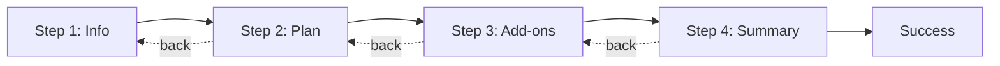

# Multi-step form

A polished, responsive onboarding wizard for a fictional gaming subscription — built as a portfolio piece on top of the [Frontend Mentor Multi-step form](https://www.frontendmentor.io/challenges/multistep-form-YVAnSdqQBJ) challenge.

Users move through four steps (personal details → plan → add-ons → summary), with validation, persistent state across navigation, and a confirmation screen when they finish.

---

## Live demo

https://multi-step-form-henna-five.vercel.app

---

## Frontend Mentor

This UI is based on the **Multi-step form** challenge from [Frontend Mentor](https://www.frontendmentor.io).

| | |
| --- | --- |
| **Challenge** | [Multi-step form](https://www.frontendmentor.io/challenges/multistep-form-YVAnSdqQBJ) |
| **Difficulty** | Advanced |
| **Skills** | HTML, CSS, JavaScript (implemented here with Next.js & TypeScript) |

### Challenge brief

Build a multi-step form that matches the provided mobile and desktop designs. Users should be able to:

- Complete each step in the sequence
- Go back to a previous step and update their choices
- See a summary on the final step and confirm their order
- Use a layout that works well on different screen sizes
- See hover and focus states on interactive elements
- Get validation when:
  - A required field is empty
  - The email address is invalid
  - A step is submitted without a valid selection (where applicable)

### Design credit

- Challenge and design assets: [Frontend Mentor](https://www.frontendmentor.io)
- Font in the design: **Ubuntu** (loaded via `next/font`)

> Thanks for checking out this project! Frontend Mentor challenges help you improve your coding skills by building realistic projects.

---

## Highlights

- **App Router steps** — Each step lives at `/apply/[step]` with Next.js layouts and server-side guards so users can’t skip ahead without completing step 1.
- **Form state that survives refresh** — Progress is synced to a cookie on change and read on the client and server.
- **Type-safe validation** — [Zod](https://zod.dev) schema + [React Hook Form](https://react-hook-form.com) with step-scoped validation on “Next”.
- **Responsive stepper** — Horizontal progress on mobile, vertical sidebar on desktop, with the FEM-style background graphic.
- **Success flow** — Server checks completion before showing the thank-you screen; form data is cleared after a short delay.

---

## Tech stack

| Category | Tools |
| --- | --- |
| Framework | [Next.js 16](https://nextjs.org) (App Router) |
| UI | [React 19](https://react.dev), [Tailwind CSS 4](https://tailwindcss.com) |
| Forms | [React Hook Form](https://react-hook-form.com), [Zod](https://zod.dev), [@hookform/resolvers](https://github.com/react-hook-form/resolvers) |
| Components | [Radix UI](https://www.radix-ui.com) primitives (toggle, switch) |
| Language | TypeScript |
| Lint / format | [Biome](https://biomejs.dev) |

---

## Getting started

### Prerequisites

- Node.js 18+
- npm (or pnpm / yarn / bun)

### Install & run

```bash
git clone <your-repo-url>
cd multi-step-form
npm install
npm run dev
```

### Scripts

| Command | Description |
| --- | --- |
| `npm run dev` | Start the development server |
| `npm run build` | Production build |
| `npm run start` | Run the production server |
| `npm run lint` | Lint with Biome |
| `npm run format` | Format with Biome |
| `npm run check` | Lint + format (write) |

---

## Project structure

```
app/
  apply/[step]/     # Wizard steps (1–4)
  apply/success/    # Confirmation (server-guarded)
features/onboarding/
  components/       # Form, stepper, step UIs
  lib/form-store/   # Cookie persistence (client + server)
  schemas/          # Zod onboarding schema
components/ui/      # Shared inputs, buttons, cards
proxy.ts            # Redirects `/` → `/apply/1`
```

---

## Flow overview



1. **Personal info** — Name, email, phone (validated before continuing).
2. **Select plan** — Arcade, Advanced, or Pro; monthly or yearly billing.
3. **Add-ons** — Optional extras with dynamic pricing.
4. **Summary** — Review selections and confirm; then redirect to success.

---

## License & attribution

- Application code: your choice of license (add one if you publish the repo).
- Frontend Mentor challenge, designs, and assets remain subject to [Frontend Mentor’s terms](https://www.frontendmentor.io).